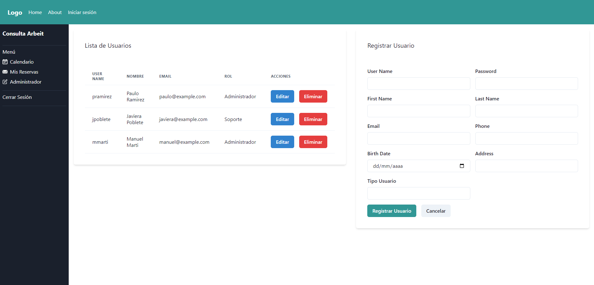

19-04-2024

Backend:
1. Validacion de datos de usuario
2. Validacion de tipo de usuario al iniciar sesion ( tipo_usuario === 1 : muestra la opcion administrador si tipo_ususario != 1 , la opcion no aparece)
3. Al presionar "Administrador" redirige a userManagment === mantenedor CRUD (solo usuario hasta el momento)
4. el formulario de crear usuario lo crea directo en la base de datos

falta:
1. Boton cerrar sesion
2. Sacar el navbar o modificarlo para que sea acorde a lo que se esta realizando 
3. Seguir con la parte basica de usuarios e interfaces

20/04/2024

Vista mantenedor 

20-04-2024 

1. se realizo reserva con autorizacion del token 

to do: 
Intentar vincular el big calendar con el endpoint y la autorizacion => buscar info de como hacerlo y que beneficios en seguridad nos trae.

21-04-2024
Actualizacion de la tabla reserva

CREATE TABLE reserva (
    id SERIAL PRIMARY KEY,
    user_name VARCHAR(255),
    fecha_reserva DATE,
    hora_inicio TIME WITH TIME ZONE,
    hora_termino TIME WITH TIME ZONE,
    telefono VARCHAR(20),
    email VARCHAR(255)
);