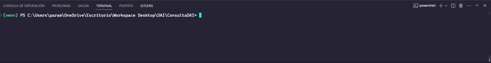

<h1>Comando para ejecutar <b>Backend</b> local</h1>

<h3>Pasos</h3>

#si no tienes el ambiente virtual creado

1.  python -m venv venv 

#avanzar hasta la carpeta script y activar el entorno virtual

2. ../backend/venv/script/./activate para activar ambiente virtual

#Instalar las dependencias  y librerias que usa el backend

3.  pip install -r requirements.txt

#CHAKRA ICONS UI
npm install @chakra-ui/icons

pip freeze > requirements.txt

#SCRIPT DE LA BASE DE DATOS

CREATE TABLE cliente (
    id SERIAL PRIMARY KEY,
    user_name VARCHAR(20) UNIQUE,
    password VARCHAR(255),
    first_name VARCHAR(50),
    last_name VARCHAR(50),
    mail VARCHAR(100),
    address VARCHAR(100),
    phone VARCHAR(13),
    birth_date DATE,
    tipo_usuario INTEGER
);

CREATE TABLE instalacion (
    id SERIAL PRIMARY KEY,
    nombre VARCHAR(100),
    direccion VARCHAR(100),
    telefono VARCHAR(15),
    correo VARCHAR(100)
);

CREATE TABLE horario (
    id SERIAL PRIMARY KEY,
    dia VARCHAR(10),
    hora_inicio TIME,
    hora_termino TIME,
    estado_disponibilidad VARCHAR(20),
    id_instalacion INTEGER REFERENCES instalacion(id)
);

CREATE TABLE reserva (
    id SERIAL PRIMARY KEY,
    user_name VARCHAR(50) REFERENCES cliente(user_name),
    fecha_reserva DATE,
    horario TIME WITH TIME ZONE, 
    telefono VARCHAR(13),
    email VARCHAR(100)
);

CREATE TABLE historial_reserva (
    id SERIAL PRIMARY KEY,
    id_cliente INTEGER REFERENCES cliente(id),
    id_instalacion INTEGER REFERENCES instalacion(id),
    fecha_reserva DATE REFERENCES reserva(fecha_reserva),
    hora_inicio TIME,
    hora_termino TIME
);
CREATE TABLE user_login (
    id SERIAL PRIMARY KEY,
    user_name VARCHAR(255) NOT NULL,
    password VARCHAR(255) NOT NULL,
    rol INTERGER NOT NULL
);

CREATE TABLE rol(
    id SERIAL PRIMARY KEY,
    nombre VARCHAR(255)
)

CREATE TABLE cliente_rol(
    id SERIAL PRIMARY KEY,
    id_cliente ,
    id_rol
)
#MODIFICACIONES 13-04-2024 23:42

CREATE OR REPLACE FUNCTION insert_user_login()
RETURNS TRIGGER AS $$
BEGIN
    INSERT INTO user_login (user_name, password, rol)
    VALUES (NEW.user_name, NEW.password, NEW.tipo_usuario);
    RETURN NEW;
END;
$$ LANGUAGE plpgsql;

-- Modificar el disparador para que use la nueva función
DROP TRIGGER IF EXISTS cliente_insert_trigger ON cliente;

CREATE TRIGGER cliente_insert_trigger
AFTER INSERT ON cliente
FOR EACH ROW
EXECUTE FUNCTION insert_user_login();

PRIMER LOGIN EXITOSO 

#SCRIPT MODIFICADO 14-04 12:03

CREATE TABLE cliente (
    id SERIAL PRIMARY KEY,
    user_name VARCHAR(20) UNIQUE,
    password VARCHAR(255),
    first_name VARCHAR(50),
    last_name VARCHAR(50),
    mail VARCHAR(100),
    address VARCHAR(100),
    phone VARCHAR(13),
    birth_date DATE,
    tipo_usuario INTEGER
);

CREATE TABLE instalacion (
    id SERIAL PRIMARY KEY,
    nombre VARCHAR(100),
    direccion VARCHAR(100),
    telefono VARCHAR(15),
    correo VARCHAR(100)
);

CREATE TABLE horario (
    id SERIAL PRIMARY KEY,
    dia VARCHAR(10),
    hora_inicio TIME,
    hora_termino TIME,
    estado_disponibilidad VARCHAR(20),
    id_instalacion INTEGER REFERENCES instalacion(id)
);

CREATE TABLE reserva (
    id SERIAL PRIMARY KEY,
    user_name VARCHAR(50) REFERENCES cliente(user_name),
    fecha_reserva DATE,
    horario TIME WITH TIME ZONE, 
    telefono VARCHAR(13),
    email VARCHAR(100)
);

CREATE TABLE historial_reserva (
    id SERIAL PRIMARY KEY,
    id_cliente INTEGER REFERENCES cliente(id),
    id_instalacion INTEGER REFERENCES instalacion(id),
    id_reserva INTEGER, 
    hora_inicio TIME,
    hora_termino TIME
);

CREATE TABLE rol (
    id SERIAL PRIMARY KEY,
    nombre VARCHAR(255)
);

CREATE TABLE cliente_rol (
    id SERIAL PRIMARY KEY,
    id_cliente INTEGER REFERENCES cliente(id),
    id_rol INTEGER REFERENCES rol(id)
);

CREATE TABLE user_login (
    id SERIAL PRIMARY KEY,
    user_name VARCHAR(255) NOT NULL,
    password VARCHAR(255) NOT NULL,
    rol INTEGER NOT NULL 
);

CREATE OR REPLACE FUNCTION insert_user_login()
RETURNS TRIGGER AS $$
BEGIN
    INSERT INTO user_login (user_name, password, rol)
    VALUES (NEW.user_name, NEW.password, NEW.tipo_usuario);
    RETURN NEW;
END;
$$ LANGUAGE plpgsql;

DROP TRIGGER IF EXISTS cliente_insert_trigger ON cliente;

CREATE TRIGGER cliente_insert_trigger
AFTER INSERT ON cliente
FOR EACH ROW
EXECUTE FUNCTION insert_user_login();
